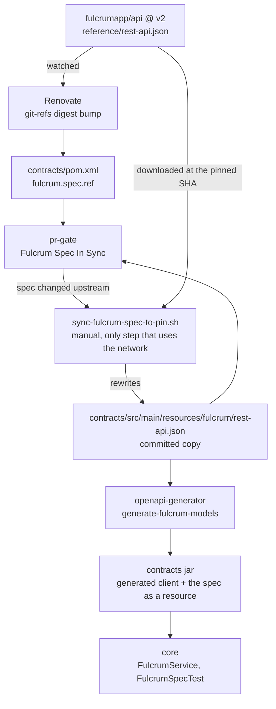

# The Fulcrum spec

The current fulcrum api spec is available at https://github.com/fulcrumapp/api/blob/v2/reference/rest-api.json resp. at https://github.com/fulcrumapp/api/blob/{commitHash}/reference/rest-api.json

Our dataflow is as following:



The left path keeps the pin current, the bottom path is what every build does: it reads the committed copy and never goes to the network.

Fulcrum publishes its spec only on the `v2` branch of [fulcrumapp/api](https://github.com/fulcrumapp/api). That repository has no tags and no releases.

* The spec is committed at `src/main/resources/fulcrum/rest-api.json`. It is never downloaded during a build, so no build fails when GitHub is down. It ships in the jar, which is where `FulcrumSpecTest` in `core` reads it.
* `fulcrum.spec.ref` in `pom.xml` holds the upstream commit that copy came from. It is the only thing we store about the upstream document, so nothing can fall out of sync with it. It must stay a SHA.
* Renovate bumps that commit. The `customManager` in `renovate.json` watches the branch head through the `git-refs` datasource.
* The `Fulcrum Spec In Sync` job in `pr-gate.yml` downloads the spec at the pinned commit and compares it with the committed copy. Most commits on `v2` do not touch the spec, so the check passes and the bump automerges.

### When the check fails

The pinned commit changed the spec. Update the committed copy on the Renovate branch:

```shell
git fetch && git switch <renovate-branch>
.github/scripts/sync-fulcrum-spec-to-pin.sh
git commit -am 'chore(deps): refresh Fulcrum OpenAPI spec' && git push
```

This is the only step that uses the network. The script changes the spec only, Renovate owns the commit hash.

A breaking change upstream then shows up as a compile error in `core`, or as a failing `FulcrumSpecTest`. That test guards what the client hardcodes: the `X-ApiToken` header, the base URL, and the `/v2/query` response shapes. If it fails, fix the client.
